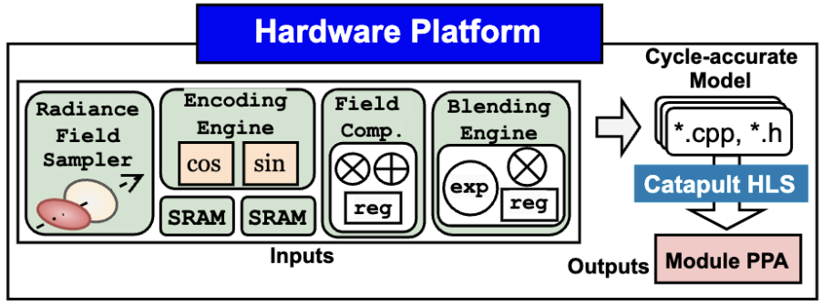

# NRSim Hardware Platform



This folder is for generating results of hardware module latency, throughput, area, and power.


## Table of Content

- [Environment Setup](#environment-setup)
- [Obtain all module results](#obtain-all-module-results)
- [Example of obtaining power and area of single module](#example-of-obtaining-power-and-area-of-single-module)
  - [Obtain Throughput, Latency, Power and Area](#obtain-throughput-latency-power-and-area)
- [Tutorial: Step by step developing customized modules](#tutorial-step-by-step-developing-customized-modules)
  - [Step 1: Overview](#step-1-overview)
  - [Step 2: Folder Structure](#step-2-folder-structure)
  - [Step 3: Coding in SystemC](#step-3-coding-in-systemc)
  - [Step 4: Testing](#step-4-testing)
  - [Step 5: Obtain power and area of the implemented module](#step-5-obtain-power-and-area-of-the-implemented-module)

## Environment Setup

```bash
export CATAPULT_HOME="/path/to/catapult/2024.1_2"
export MATCHLIB_HOME="/path/to/matchlib-20240726/cmod/include"
export PDK_PATH="/path/to/..."  # Used in S0_scripts/hls/catapult.global.tcl
export BASELIB=".."             # Used in S0_scripts/hls/catapult.global.tcl
export TECHNOLOGY=".."          # Used in S0_scripts/hls/catapult.global.tcl
```

## Obtain all module results

```bash
cd S0_scripts                   # enter the scripts directory
./report_all.sh
```

## Example of obtaining power and area of single module

### Obtain Throughput, Latency, Power and Area

```bash
cd S0_scripts                   # enter the scripts directory

MODULE=GSCore/QSU               # define module path

make hls MODULE=$MODULE \       # run high-level synthesis
     HLS_BUILD_NAME=build_hls \
     FC_BUILD_NAME=build_fc \
     CLK_PERIOD=1.0 \
     TECH_NODE=tn28rvt9t

./report_module.sh $MODULE         # extract and summarize all results
```

- Sample output

```yaml
=======================================================================================================
  TOTAL AREA (After Assignment):    1117.325             592.000 426.000                              
=======================================================================================================
  pre_pwropt_default_Verilog       100.00    100.00 
  
Power Report (uW)
                                                                                                                               Memory Register Combinational Clock Network  Total 
  ---------------------------------------------------------------------------------------------------------------------------- ------ -------- ------------- ------------- ------
--
  pre_pwropt_default_Verilog                                                                                                                                                      
    Static                                                                                                                       0.00     6.84          5.51          0.35  12.69 
    Dynamic                                                                                                                      0.00   370.47         59.54        184.36 614.36 
    Total                                                                                                                        0.00   377.31         65.05        184.71 627.05 
                                                                                                                                                                                  
=======================================================================================================
Processes/Blocks in Design
  Process       Real Operation(s) count Latency Throughput Reset Length II Comments 
  ------------- ----------------------- ------- ---------- ------------ -- --------
  /QSU/QSU_CALC                      63       2          1            1  0          
  Design Total:                      63       2          1            1  1          
  
Clock Information
  Clock Signal Edge   Period Sharing Alloc (%) Uncertainty Used by Processes/Blocks 
  ------------ ------ ------ ----------------- ----------- ------------------------
  clk          rising  1.000              0.00    0.000000 /QSU/QSU_CALC            
  
I/O Data Ranges
  Port          Mode DeclType DeclWidth DeclRange ActType ActWidth ActRange 
  ------------- ---- -------- --------- --------- ------- -------- --------
  clk           IN   Unsigned         1                                     
=======================================================================================================
#            V C S   S i m u l a t i o n   R e p o r t 
# Time: 38000 ps
# CPU Time:      0.050 seconds;       Data structure size:   0.0Mb
```

## Tutorial: Step by step developing customized modules

### Step 1: Overview

Navigate to `A1_cmod` and create your own modules. You can organize them into a folder with multiple submodules or subdirectories. Regardless of the folder structure, all modules can be processed following the instructions in [Example of obtaining power and area of a single module](#example-of-obtaining-power-and-area-of-single-module).

- *E.g.*, `mkdir -p A1_cmod/GSCore/QSU` — this creates a directory for building a Quicksort unit.

### Step 2: Folder Structure

The folder structure should look like this:

```bash
Project/
├── Module/
│   ├── CMakeLists.txt
│   ├── Module.h
│   └── testbench.cpp
└── CMakeLists.txt
```

- `Project/CMakeLists.txt` contains library path configurations (refer to `GSCore/CMakeLists.txt`).
- `Project/Module/CMakeLists.txt` is for the module itself.
- `Module.h` contains the main hardware implementation.
- `testbench.cpp` is used to test the module, similar to how it's done in RTL design.

### Step 3: Coding in SystemC

Implement your own modules using SystemC. You can reference sample implementations in the same folder or check out the [MatchLib examples](https://github.com/hlslibs/matchlib_toolkit/tree/main/examples) and the [Connections guide](https://github.com/hlslibs/matchlib_connections/blob/master/pdfdocs/connections-guide.pdf) for guidance on developing hardware in SystemC.

### Step 4: Testing

Once the module is implemented, you can compile and test it locally without involving HLS tools, using standard C simulation.

```bash
cd A1_cmod/GSCore        # navigate to the desired pipeline
cmake .
cd QSU/                  # navigate to the specific module
make                     # compile the module
./sim_QSU                # run C simulation
```

- Sample output

```yaml
Connections Clock: tb.clk Period: 1 ns
QSUInput @ timestep: 19 ns: Depth = 10, GID = 1000
QSUInput @ timestep: 20 ns: Depth = 20, GID = 1001
QSUInput @ timestep: 21 ns: Depth = 30, GID = 1002
QSUInput @ timestep: 22 ns: Depth = 40, GID = 1003
QSUInput @ timestep: 23 ns: Depth = 50, GID = 1004
QSUInput @ timestep: 24 ns: Depth = 60, GID = 1005
Expected pivot values: 20 40 60 80 100 120 140 
QSUOutput @ timestep: 29 ns: GID = 1000, Subset = 0
  Expected Subset: 0 ✓
QSUOutput @ timestep: 30 ns: GID = 1001, Subset = 1
  Expected Subset: 1 ✓
QSUOutput @ timestep: 31 ns: GID = 1002, Subset = 1
  Expected Subset: 1 ✓
...
```

### Step 5: Obtain power and area of the implemented module

Refer to [Example of obtaining power and area of a single module](#example-of-obtaining-power-and-area-of-single-module).