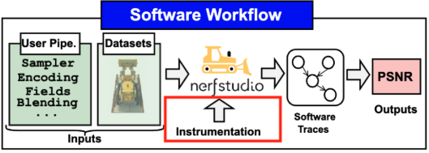
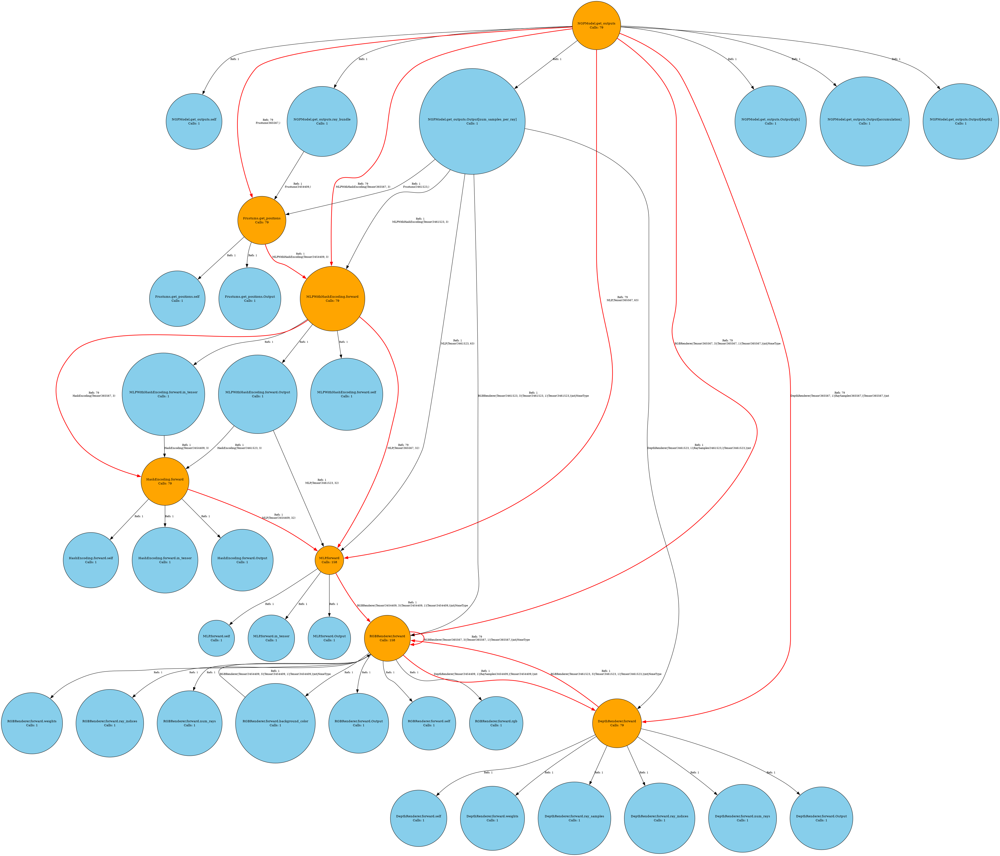

# NRSim Instrumentation



This folder is for instrumenting neural rendering frameworks and obtaining operator information given an input pipeline and datasets. The obtained traces will be used and processed in the `Operators` folder.

## Table of Contents

- [Setup Environment](#setup-environment)
  - [Setup CUDA](#setup-cuda)
  - [Setup Nerfstudio](#setup-nerfstudio)
    - [Install dependencies](#install-dependencies)
    - [Install Nerfstudio](#install-nerfstudio)
    - [Copy instrumentation plug-in into Nerfstudio](#copy-instrumentation-plug-in-into-nerfstudio)
    - [Download dataset](#download-dataset)
    - [Reconstruct a scene](#reconstruct-a-scene)
    - [Render a scene](#render-a-scene)
- [Instrumentation](#instrumentation)
- [Custom Pipeline Instrumentation](#custom-pipeline-instrumentation)

## Setup Environment

In this example, we will use Nerfstudio and set up the environment related to it.

### Setup CUDA

- Get [CUDA-11.8](https://developer.nvidia.com/cuda-11-8-0-download-archive)

```bash
wget https://developer.download.nvidia.com/compute/cuda/11.8.0/local_installers/cuda_11.8.0_520.61.05_linux.run
chmod +x ./cuda_11.8.0_520.61.05_linux.run
./cuda_11.8.0_520.61.05_linux.run --silent --tmpdir=. --toolkit --toolkitpath=/change/this/path/cuda-11.8/
export PATH=/change/this/path/cuda-11.8/bin${PATH:+:${PATH}}
```

### Setup Nerfstudio

#### Install dependencies

```bash
conda create --name nerfstudio -y python=3.8
conda activate nerfstudio
pip install --upgrade pip
pip install torch==2.1.2+cu118 torchvision==0.16.2+cu118 --extra-index-url https://download.pytorch.org/whl/cu118
conda install -c "nvidia/label/cuda-11.8.0" cuda-toolkit
pip install ninja git+https://github.com/NVlabs/tiny-cuda-nn/#subdirectory=bindings/torch
conda install -c conda-forge graphviz python-graphviz
```

#### Install Nerfstudio

```bash
git clone https://github.com/nerfstudio-project/nerfstudio.git
cd nerfstudio
pip install --upgrade pip setuptools
pip install -e .
```

#### Copy instrumentation plug-in into Nerfstudio

```bash
cp -r instrumentation nerfstudio/nerfstudio/
cp eval.py nerfstudio/nerfstudio/scripts
```

#### Download dataset

```bash
mkdir -p /tmp/nerf
pip install gdown
cd /tmp/nerf
gdown 'https://drive.google.com/uc?id=1wXXBJjPbWNfAdg54698E6wU4LQ8aJQaF'
unzip nerf_synthetic.zip -d nerf_synthetic
gdown 'https://drive.google.com/uc?id=14XLXMvebI_iUqdbt1nICcUUFG_IKIcwz'
gdown 'https://drive.google.com/uc?id=1qNlare9oStZbJHdUwngU1mcVIPB8eeJd'
unzip 360_v2.zip -d mip360
unzip 360_extra_scenes.zip -d mip360
```

#### Reconstruct a scene

```bash
CUDA_VISIBLE_DEVICES=0 ns-train vanilla-nerf --output-dir output_result --vis=wandb --max-num-iterations=10000 --data /tmp/nerf/nerf_synthetic/mic blender-data
CUDA_VISIBLE_DEVICES=1 ns-train instant-ngp --output-dir output_result --vis=wandb --max-num-iterations=10000 --data /tmp/nerf/nerf_synthetic/mic blender-data
CUDA_VISIBLE_DEVICES=2 ns-train splatfacto --output-dir output_result --vis=wandb --max-num-iterations=100000 --data /tmp/nerf/nerf_synthetic/mic blender-data
```

#### Render a scene

```bash
CUDA_VISIBLE_DEVICES=0 ns-eval --load-config output_result/mic/instant-ngp/2025-06-20_150659/config.yml --render-output-path output_render --output-path output_render/output.json
```

- Check the results in `output_render/output.json` for PSNR, SSIM, and LPIPS

## Instrumentation

After installing the neural rendering framework, you can execute the neural rendering process to obtain execution traces. The following command generates PKL and PNG files for further analysis:

```bash
ns-eval --load-config output_result/mic/vanilla-nerf/[checkpoint]/config.yml --render-output-path output_render --output-path output_render/output.json
ns-eval --load-config output_result/mic/instant-ngp/[checkpoint]/config.yml --render-output-path output_render --output-path output_render/output.json
ns-eval --load-config output_result/mic/splatfacto/[checkpoint]/config.yml --render-output-path output_render --output-path output_render/output.json
```

The following is a sample output of the grid-based neural rendering pipeline:



## Custom Pipeline Instrumentation

After developing a customized neural rendering pipeline, algorithm designers can instrument it to obtain an operator graph for further processing and to acquire preliminary PPA results at the earliest stage. Below, we describe how to include additional tracing:

- In `nerfstudio/nerfstudio/instrumentation/trace_config.json`, users can specify the functions to be traced.
- Example configuration:

```json
"functions_to_trace": [
    "nerfstudio.cameras.rays.RaySamples.get_weights",
    "nerfstudio.cameras.rays.RayBundle.get_ray_samples",
    "nerfstudio.cameras.rays.Frustums.get_positions",
    "nerfstudio.model_components.ray_samplers.PDFSampler.generate_ray_samples",
    "nerfstudio.model_components.ray_samplers.UniformSampler.generate_ray_samples",
    "nerfstudio.field_components.encodings.RFFEncoding.forward",
    "nerfstudio.field_components.mlp.MLP.forward",
    "nerfstudio.field_components.field_heads.DensityFieldHead.forward",
    "nerfstudio.field_components.field_heads.RGBFieldHead.forward",
    "nerfstudio.model_components.renderers.RGBRenderer.forward",
    "nerfstudio.models.instant_ngp.NGPModel.get_outputs"
],
```

- After rendering completes, the operator graph is built. In a subsequent pass, the system determines whether it can be accelerated on the target hardware platform or whether additional hardware modules need to be implemented and linked.
