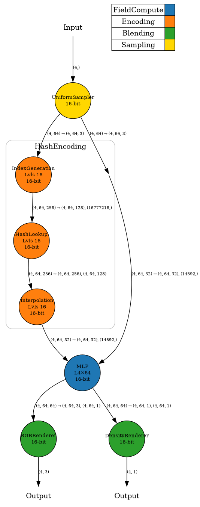

# NRSim Operator


This folder is for obtaining high level characteristics of operators in neural rendering pipelines.

## Table of Contents

- [Roofline](#roofline)
- [Operator graph and json file for scheduling](#operator-graph-and-json-file-for-scheduling)
- [Include customized operators and pipelines](#include-customized-operators-and-pipelines)

## Roofline

- Observe high-level operator characteristics. It will print out arithmetic intensity, data requirements, FLOPs required, and other high-level characteristics.

```bash
python plot_roofline.py
```

- Sample output


## Operator graph and json file for scheduling

- Check `plot_operator.py` to generate an operator graph. This will provide coarse-grained and fine-grained operator graphs.

```bash
python plot_operator.py
```

- Sample output




## Include customized operators and pipelines

Here, we describe how to include custom operators in this project.

- Step 1: Navigate to `operators`. First, categorize the custom operators into four stages: sampling, encoding, computation, and blending.
- Step 2: In the appropriate folder, add the custom operators. Specify the required information: inputs, weights, outputs, and FLOPs.
- Step 3: If an operator requires more fine-grained characteristics, create a subclass that inherits from the coarse-grained operators, and use the subclass to obtain high-level characteristics.
- Step 4: Finally, navigate to `pipelines` and build the final customized pipeline by connecting operators
- Sample operator

```python
class RGBRendererOperator(BlendingOperator):
    def __init__(self, dim, background_color="random", bitwidth: int = 16, graph=None):
        self.background_color = background_color
        super().__init__(dim, bitwidth, graph)
        self.op_type = "RGBRenderer"

    def get_tensors(self):
        B, N = self.dim[:2]
        input_a = B * N * 3
        input_b = B * N * 1
        output = B * 3
        return input_a, input_b, output

    def get_num_ops(self):
        B, N = self.dim[:2]
        return B * N * 3 * 2
```

- Sample pipeline

```python
g = OperatorGraph()
sampler = UniformSamplerOperator(dim, sampler_type="uniform", bitwidth=16, graph=g)
hash_encoding = HashEncodingOperator(dim, num_levels=16, bitwidth=16, graph=g)
mlp_in_dim = hash_encoding.num_levels * hash_encoding.features_per_level
mlp = MLPOperator(dim, in_dim=mlp_in_dim, num_layers=4, layer_width=64,
                    use_bias=True, bitwidth=16, graph=g)
rgb_renderer = RGBRendererOperator(dim, background_color="random", bitwidth=16, graph=g)
density_renderer = DensityRendererOperator(dim, method="expected", bitwidth=16, graph=g)
sampler.add_child(hash_encoding)
hash_encoding.add_child(mlp)
mlp.add_child(rgb_renderer)
mlp.add_child(density_renderer)
```