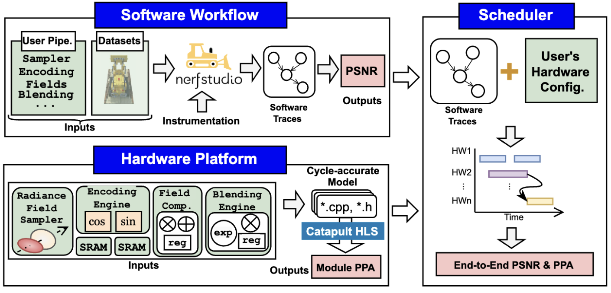

# NRSim



**NRSim** simulates both accuracy and efficiency by accepting algorithm workflows from standard libraries and hardware configurations, with <10% modeling error.


## Software Workflow

The software workflow obtains the operator graph through instrumentation and operator processing in `Instrumentation` and `Operators`.


See [`Instrumentation`](./Instrumentation) and [`Operators`](./Operators) folders for more details

## Hardware Platform

The hardware platform obtains the power, area, throughput, and latency of hardware modules in neural rendering accelerators.

```yaml
=======================================================================================================
  TOTAL AREA (After Assignment):    1117.325             592.000 426.000                              
=======================================================================================================
  pre_pwropt_default_Verilog       100.00    100.00 
  
Power Report (uW)
                                                                                                                               Memory Register Combinational Clock Network  Total 
  ---------------------------------------------------------------------------------------------------------------------------- ------ -------- ------------- ------------- ------
--
  pre_pwropt_default_Verilog                                                                                                                                                      
    Static                                                                                                                       0.00     6.84          5.51          0.35  12.69 
    Dynamic                                                                                                                      0.00   370.47         59.54        184.36 614.36 
    Total                                                                                                                        0.00   377.31         65.05        184.71 627.05 
...
```

See [`Hardware`](./Hardware) folder for more details

## Scheduler

Given the operators from the software workflow and the hardware module results from the hardware platform, the scheduler schedules them and obtains the final PPA along with DSE.

```yaml
Pareto front (≥30 FPS, Lego):
 CCU  QSU  BSU  VRCore  Buf  BW_GBps Area_mm2 Energy_mJ FPS BW_util
   4    4    2     128   16     51.2     6.97       3.3 419    0.04
   8    4    2     128   16     51.2     7.79       4.5 422    0.04
  16    4    2     128   16     51.2     9.43       6.9 424    0.04
  32    4    2     128   16     51.2    12.71      11.8 425    0.04
  32   32   16     128   16     51.2    12.96       8.2 634    0.07
```

See [`Scheduler`](./Scheduler) folder for more details

