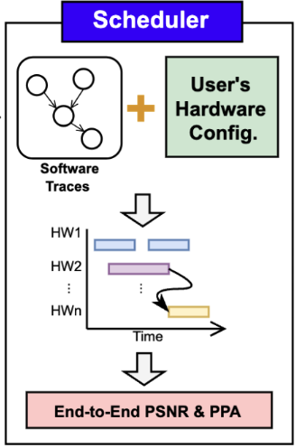

# NRSim Scheduler



This folder schedules the neural-rendering operator graph defined in `Operator` onto the hardware modules specified in `Hardware`, and calculates the resulting latency.

## Table of Contents

- [Schedule](#schedule)

## Schedule

Here, we provide a Python implementation of GSCore scheduling. The file assumes that the operator graph and hardware results have already been produced in earlier stages (the software workflow and hardware platform, respectively) and offers examples of both scheduling and design-space exploration.

```bash
python gscore_schedule.py
```

- Sample output

```yaml
Pareto front (≥30 FPS, Lego):
 CCU  QSU  BSU  VRCore  Buf  BW_GBps Area_mm2 Energy_mJ FPS BW_util
   4    4    2     128   16     51.2     6.97       3.3 419    0.04
   8    4    2     128   16     51.2     7.79       4.5 422    0.04
  16    4    2     128   16     51.2     9.43       6.9 424    0.04
  32    4    2     128   16     51.2    12.71      11.8 425    0.04
  32   32   16     128   16     51.2    12.96       8.2 634    0.07
```